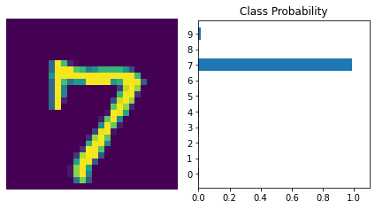
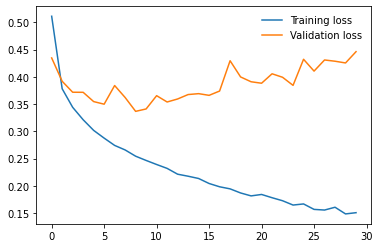
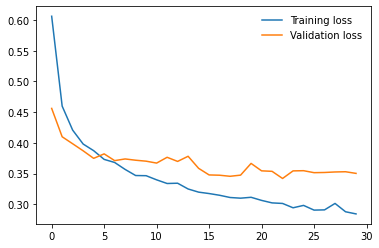

# PyTorch MNIST
   AI algorithms will be incorporated into more and more everyday applications. For example, you might want to include an image classifier in a smartphone app. To do this, you'd use a deep learning model trained on hundreds of thousands of images as part of the overall application architecture. A large part of software development in the future will be using these types of models as common parts of applications.


   In this project, I have trained 2 image classifiers to recognize Hand written digits and Clothing Types. I have used **_[PyTorch](https://pytorch.org/)_** library and created very basic 3-4 layer small models. In practice, one would use Convolutional Neural Networks (CNN) for these type of problems. We'll be using popular MNIST and Fashion MNIST dataset of 24*24 Gray scale images.
1. [Hand Written Digit Classification(MNIST)](https://github.com/cloud-VG/PyTorch_MNIST/blob/master/MNIST_PyTorch.ipynb)
2. [Clothing Classification(Fashion MNIST)](https://github.com/cloud-VG/PyTorch_MNIST/blob/master/Fashion_MNIST_PyTorch.ipynb)
### Sample Output (MNIST)


# Overfitting

   If we look at the training and validation losses as we train the **_Fashion MNIST_** network, we can see a phenomenon known as overfitting.




   
   The network learns the training set better and better, resulting in lower training losses. However, it starts having problems generalizing to data outside the training set leading to the validation loss increasing. The ultimate goal of any deep learning model is to make predictions on new data, so we should strive to get the lowest validation loss possible. One option is to use the version of the model with the lowest validation loss, here the one around 8-10 training epochs. This strategy is called early-stopping. In practice, you'd save the model frequently as you're training then later choose the model with the lowest validation loss.

The most common method to reduce overfitting (outside of early-stopping) is dropout, where we randomly drop input units. This forces the network to share information between weights, increasing it's ability to generalize to new data. Adding dropout in PyTorch is straightforward using the **_[nn.Dropout](https://pytorch.org/docs/stable/nn.html?highlight=dropout#torch.nn.Dropout)_** module.

```python
class Model(nn.Module):
    def __init__(self):
        ...
        # Dropout module with 0.2 drop probability
        self.dropout = nn.Dropout(p=0.2)
        
    def forward(self, x):
        ...
        x = self.dropout(F.relu(self.layer(x)))
```

During training we want to use dropout to prevent overfitting, but during inference we want to use the entire network. So, we need to turn off dropout during validation, testing, and whenever we're using the network to make predictions. To do this, you use **_model.eval()_**. This sets the model to evaluation mode where the dropout probability is 0. You can turn dropout back on by setting the model to train mode with **_model.train()_**. In general, the pattern for the validation loop will look like this, where you turn off gradients, set the model to evaluation mode, calculate the validation loss and metric, then set the model back to train mode.

```python
# turn off gradients
with torch.no_grad():

    # set model to evaluation mode
    model.eval()

    # validation pass here
    for images, labels in testloader:
        ...

# set model back to train mode
model.train()
```

After Implementing Dropout technique, the result will look like,


